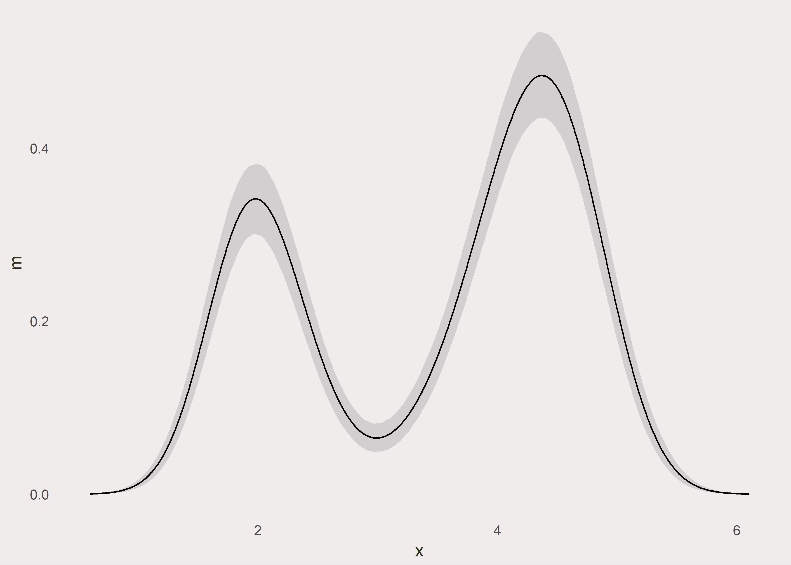

Bootstrapping Density Function and plotting with ggplot
-------------------------------------------------------

Lorem ipsum dolor sit amet, no minimum complectitur vim, an enim mandamus complectitur mea. Enim noluisse appareat in est, harum graece at nec. Cu est commune pertinacia omittantur. Viris argumentum reprimique at vel, mazim putant accusata cu mel. Propriae sensibus abhorreant eu has, per id partem veritus civibus, solet phaedrum periculis nam no. Sit et idque inani populo. Quod aeque sadipscing cu cum, pro ex malorum alienum suscipit.

``` r
rm(list = ls())

library(ggplot2)
library(dplyr)
library(magrittr)
library(broom)
library(purrr)


set.seed(2323)
```

Functions for later use
-----------------------

Lorem ipsum dolor sit amet, no minimum complectitur vim, an enim mandamus complectitur mea. Enim noluisse appareat in est, harum graece at nec. Cu est commune pertinacia omittantur. Viris argumentum reprimique at vel, mazim putant accusata cu mel. Propriae sensibus abhorreant eu has, per id partem veritus civibus, solet phaedrum periculis nam no. Sit et idque inani populo. Quod aeque sadipscing cu cum, pro ex malorum alienum suscipit.

``` r
theme_c <- function(...) {
  require(scales)
  theme_minimal() +
    theme(
      text = element_text(family = "Source Sans Pro", color = "#173e43", size=11),
      # panel.grid.minor = element_line(color = "#ebebe5", size = 0.2),
      panel.grid.major = element_line(color = "#e3e3e3", size = 1.05),
      # panel.grid.major = element_line(color = "#173e43", size = 0.5),
      panel.grid.minor = element_blank(),
      plot.background = element_rect(fill = "#f6f1ed", color = NA), 
      panel.background = element_rect(fill = "#f6f1ed", color = NA), 
      legend.background = element_rect(fill = "#f6f1ed", color = NA),
      # panel.border = element_rect(color = "#173e43", size = 0.5, fill = NA),
      panel.border = element_blank(),
      legend.position = "bottom",
      ...
    )
}
```

Getting the data
----------------

``` r
faithful <- faithful %>%
  as_tibble()

eruptions <- faithful$eruptions

faithful %>% head()
```

    ## # A tibble: 6 x 2
    ##   eruptions waiting
    ##       <dbl>   <dbl>
    ## 1     3.600      79
    ## 2     1.800      54
    ## 3     3.333      74
    ## 4     2.283      62
    ## 5     4.533      85
    ## 6     2.883      55

Plotting the Distribution
-------------------------

``` r
faithful %>% 
  ggplot(aes(x = eruptions)) +
  geom_histogram(fill = "#173e43", color="#e3e3e3") +
  theme_c() +
  labs(title = "Histogram Plot",
       subtitle  = "")  +
  scale_x_continuous(breaks=seq(1,6,by=1)) +
  ylab("Frequency\n") +
  xlab("\nEruptions")
```


Bootstrapping
-------------

Lorem ipsum dolor sit amet, no minimum complectitur vim, an enim mandamus complectitur mea. Enim noluisse appareat in est, harum graece at nec. Cu est commune pertinacia omittantur. Viris argumentum reprimique at vel, mazim putant accusata cu mel. Propriae sensibus abhorreant eu has, per id partem veritus civibus, solet phaedrum periculis nam no. Sit et idque inani populo. Quod aeque sadipscing cu cum, pro ex malorum alienum suscipit.

``` r
#init
fit1 <- density(eruptions)

get_bs_sample <- function(x){
  x[sample(length(x), replace = TRUE)]
}

density_from_bs <- function(x, min, max){
  x_sample <- get_bs_sample(x)
  density(x_sample, from = min, to = max)
}

min_ <- min(fit1$x)
max_ <- max(fit1$x)

bs_samples <-  map(1:1000, ~density_from_bs(eruptions, min_, max_)) %>%
  map_df(~tidy(.)) %>% 
  group_by(x) %>% 
  mutate(mean  = mean(y),
         y95   = quantile(y, 0.95),
         y05   = quantile(y, 0.05),
         min   = min(y),
         max   = max(y),
         dist  = abs(y - mean)) %>% 
  ungroup()

bs_samples_5000 <- bs_samples %>% 
  sample_n(size = 5000, replace = FALSE)
```

Plotting
--------

``` r
ggplot() +
  geom_jitter(data = bs_samples_5000, aes(x=x, y=y), alpha=0.1, color="#173e43") +
  geom_ribbon(data = bs_samples,
              aes(x=x,y=y,ymin = min, ymax = max),
              alpha=0.05, color="#dddfd4") +
  geom_line(data=fit1 %>% tidy, aes(x=x, y=y), color="#3fb0ac", size=1) +
  theme_c() +
  labs(title = "FItted Density Curve of Eruptions",
       subtitle  = "CI generated with boostrap resampling R = 1000")  +
  scale_y_continuous(breaks = seq(0,0.5,by=0.1),
                     labels = seq(0,0.5,by=0.1) %>% percent()) +
  scale_x_continuous(breaks = seq(1,6,by=1)) +
  ylab("Density\n") +
  xlab("\nEruptions")
```


