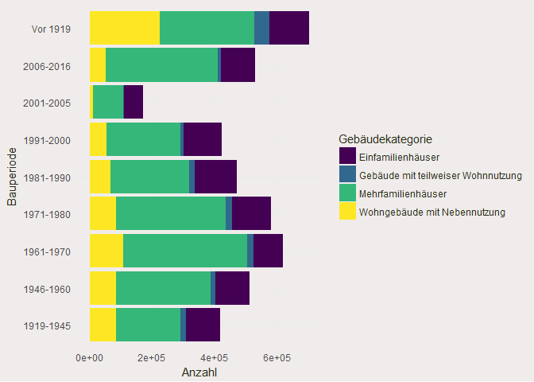

Analysis of Swiss Housing Landscape
-----------------------------------

``` r
rm(list = ls())

library(maptools)
```

    ## Loading required package: sp

    ## Checking rgeos availability: TRUE

``` r
library(broom)
library(viridis)
```

    ## Loading required package: viridisLite

``` r
library(raster)
library(rgdal)
```

    ## rgdal: version: 1.2-18, (SVN revision 718)
    ##  Geospatial Data Abstraction Library extensions to R successfully loaded
    ##  Loaded GDAL runtime: GDAL 2.2.3, released 2017/11/20
    ##  Path to GDAL shared files: C:/Users/Dominik Peter/Documents/R/win-library/3.4/rgdal/gdal
    ##  GDAL binary built with GEOS: TRUE 
    ##  Loaded PROJ.4 runtime: Rel. 4.9.3, 15 August 2016, [PJ_VERSION: 493]
    ##  Path to PROJ.4 shared files: C:/Users/Dominik Peter/Documents/R/win-library/3.4/rgdal/proj
    ##  Linking to sp version: 1.2-7

``` r
library(rgeos)
```

    ## rgeos version: 0.3-26, (SVN revision 560)
    ##  GEOS runtime version: 3.6.1-CAPI-1.10.1 r0 
    ##  Linking to sp version: 1.2-7 
    ##  Polygon checking: TRUE

``` r
library(tidyverse)
```

    ## -- Attaching packages ------------------------------------------------------------------------------------ tidyverse 1.2.1 --

    ## v ggplot2 2.2.1     v purrr   0.2.4
    ## v tibble  1.3.4     v dplyr   0.7.4
    ## v tidyr   0.7.2     v stringr 1.2.0
    ## v readr   1.1.1     v forcats 0.2.0

    ## -- Conflicts --------------------------------------------------------------------------------------- tidyverse_conflicts() --
    ## x tidyr::extract() masks raster::extract()
    ## x dplyr::filter()  masks stats::filter()
    ## x dplyr::lag()     masks stats::lag()
    ## x dplyr::select()  masks raster::select()

``` r
library(readxl)
library(readr)
library(magrittr)
```

    ## 
    ## Attaching package: 'magrittr'

    ## The following object is masked from 'package:purrr':
    ## 
    ##     set_names

    ## The following object is masked from 'package:tidyr':
    ## 
    ##     extract

    ## The following object is masked from 'package:raster':
    ## 
    ##     extract

Functions for later use
-----------------------

``` r
clean_data <- function(df, year){
  df <- df %>% select(1:3,
                      colnames(.) %>%
                        endsWith(year) %>%
                        which
                      )
  colnames(df)[1:3] <- c("Kanton / Bezirk / Gemeinde",
                        "Gebäudekategorie",
                        "Wohnungsfläche")
  colnames(df)[endsWith(colnames(df), year)] <- colnames(df)[endsWith(colnames(df), year)] %>% 
    str_sub(start=1, end=-5)
  colnames(df) <- str_replace_all(colnames(df), "\\.", " ")
  
  regx <- "^(\\.\\.\\.\\.\\.)"
  
  df %>% gather(Bauperiode, Anzahl, -(1:3)) %>% 
    filter(`Kanton / Bezirk / Gemeinde` %>% str_detect(regx)) %>% 
    mutate(Anzahl   = as.numeric(Anzahl),
           Gemeinde = `Kanton / Bezirk / Gemeinde`,
           id       = Gemeinde %>% str_extract("\\d+") %>% as.numeric(),
           Gemeinde = Gemeinde %>% str_replace("\\.+\\d+\\s", "")) %>% 
    select(-`Kanton / Bezirk / Gemeinde`)
}

theme_c <- function(...) {
  theme_minimal() +
    theme(
      text = element_text(color = "#283018"),
      # panel.grid.minor = element_line(color = "#ebebe5", size = 0.2),
      panel.grid.major = element_line(color = "#ebebe5", size = 0.2),
      panel.grid.minor = element_blank(),
      plot.background = element_rect(fill = "#f0eceb", color = NA), 
      panel.background = element_rect(fill = "#f0eceb", color = NA), 
      legend.background = element_rect(fill = "#f0eceb", color = NA),
      panel.border = element_blank(),
      ...
    )
}
```

Getting the dat
---------------

``` r
df <- read_tsv("../_data/housing-landscape/wohnungen_2013-2016.csv",
               skip=2, locale = locale(encoding = 'ISO-8859-1')) %>% 
  clean_data("2016")
```

    ## Parsed with column specification:
    ## cols(
    ##   .default = col_integer(),
    ##   `Kanton (-) / Bezirk (>>) / Gemeinde (......)` = col_character(),
    ##   Gebäudekategorie = col_character(),
    ##   Wohnungsfläche = col_character()
    ## )

    ## See spec(...) for full column specifications.

``` r
df %>% head()
```

    ## # A tibble: 6 x 6
    ##    Gebäudekategorie Wohnungsfläche Bauperiode Anzahl        Gemeinde    id
    ##               <chr>          <chr>      <chr>  <dbl>           <chr> <dbl>
    ## 1 Einfamilienhäuser         <30 m2  Vor 1919       0 Aeugst am Albis     1
    ## 2 Einfamilienhäuser       30-49 m2  Vor 1919       0 Aeugst am Albis     1
    ## 3 Einfamilienhäuser       50-69 m2  Vor 1919       5 Aeugst am Albis     1
    ## 4 Einfamilienhäuser       70-99 m2  Vor 1919      14 Aeugst am Albis     1
    ## 5 Einfamilienhäuser     100-149 m2  Vor 1919      19 Aeugst am Albis     1
    ## 6 Einfamilienhäuser        150+ m2  Vor 1919      26 Aeugst am Albis     1

``` r
df %>% 
  ggplot(aes(x=Bauperiode, y=Anzahl, fill=Gebäudekategorie)) +
  geom_bar(stat="identity") +
  coord_flip() +
  theme_c() +
  scale_fill_viridis(discrete=TRUE, direction = 1)
```


