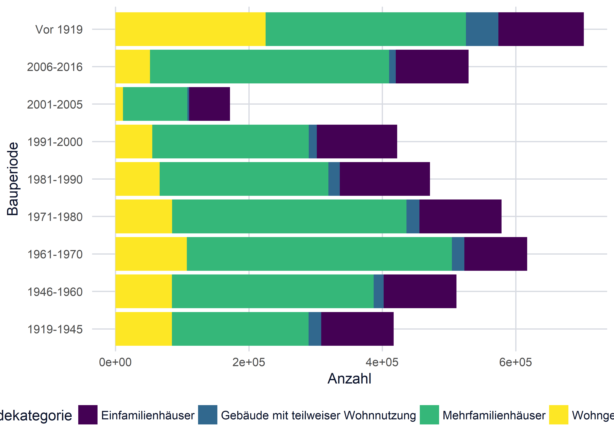

Analysis of Swiss Housing Landscape
-----------------------------------

``` r
rm(list = ls())

library(maptools)
library(broom)
library(viridis)
library(raster)
library(rgdal)
library(rgeos)
library(tidyverse)
library(readxl)
library(readr)
library(magrittr)
```

Functions for later use
-----------------------

``` r
clean_data <- function(df, year){
  df <- df %>% select(1:3,
                      colnames(.) %>%
                        endsWith(year) %>%
                        which
                      )
  colnames(df)[1:3] <- c("Kanton / Bezirk / Gemeinde",
                        "Gebäudekategorie",
                        "Wohnungsfläche")
  colnames(df)[endsWith(colnames(df), year)] <- colnames(df)[endsWith(colnames(df), year)] %>% 
    str_sub(start=1, end=-5)
  colnames(df) <- str_replace_all(colnames(df), "\\.", " ")
  
  regx <- "^(\\.\\.\\.\\.\\.)"
  
  df %>% gather(Bauperiode, Anzahl, -(1:3)) %>% 
    filter(`Kanton / Bezirk / Gemeinde` %>% str_detect(regx)) %>% 
    mutate(Anzahl   = as.numeric(Anzahl),
           Gemeinde = `Kanton / Bezirk / Gemeinde`,
           id       = Gemeinde %>% str_extract("\\d+") %>% as.numeric(),
           Gemeinde = Gemeinde %>% str_replace("\\.+\\d+\\s", "")) %>% 
    select(-`Kanton / Bezirk / Gemeinde`)
}

theme_c <- function(...) {
  theme_minimal() +
    theme(
      text = element_text(color = "#283018"),
      # panel.grid.minor = element_line(color = "#ebebe5", size = 0.2),
      panel.grid.major = element_line(color = "#ebebe5", size = 0.2),
      panel.grid.minor = element_blank(),
      plot.background = element_rect(fill = "#f0eceb", color = NA), 
      panel.background = element_rect(fill = "#f0eceb", color = NA), 
      legend.background = element_rect(fill = "#f0eceb", color = NA),
      panel.border = element_blank(),
      ...
    )
}
```

Getting the dat
---------------

``` r
df <- read_tsv("../_data/housing-landscape/wohnungen_2013-2016.csv",
               skip=2, locale = locale(encoding = 'ISO-8859-1')) %>% 
  clean_data("2016")

df %>% head()
```

    ## # A tibble: 6 x 6
    ##    Gebäudekategorie Wohnungsfläche Bauperiode Anzahl        Gemeinde    id
    ##               <chr>          <chr>      <chr>  <dbl>           <chr> <dbl>
    ## 1 Einfamilienhäuser         <30 m2  Vor 1919       0 Aeugst am Albis     1
    ## 2 Einfamilienhäuser       30-49 m2  Vor 1919       0 Aeugst am Albis     1
    ## 3 Einfamilienhäuser       50-69 m2  Vor 1919       5 Aeugst am Albis     1
    ## 4 Einfamilienhäuser       70-99 m2  Vor 1919      14 Aeugst am Albis     1
    ## 5 Einfamilienhäuser     100-149 m2  Vor 1919      19 Aeugst am Albis     1
    ## 6 Einfamilienhäuser        150+ m2  Vor 1919      26 Aeugst am Albis     1

Plotting
--------

``` r
df %>% 
  ggplot(aes(x=Bauperiode, y=Anzahl, fill=Gebäudekategorie)) +
  geom_bar(stat="identity") +
  coord_flip() +
  theme_c() +
  scale_fill_viridis(discrete=TRUE, direction = 1)
```


